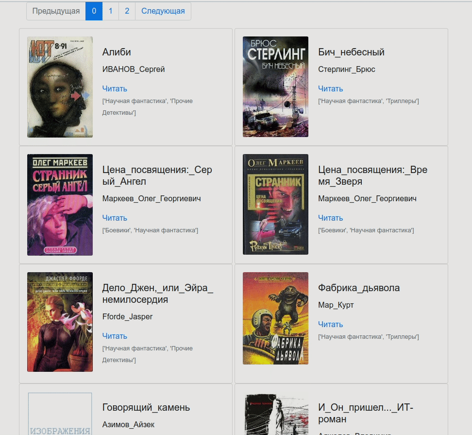

## Рендер онлайн-библиотеки

Программа генерирует простой сайт с пагинацией.
Данные для работы загружает из books_info.json и подкаталогов в books получаемые с помощью 
[парсера](https://github.com/darkdkl/books-library-restyle)

В проекте используются Jinja2 для геренации шаблонов,
livereload для локального web сервера
### Установка
`
pip3 install -r req.txt
`

Демо сайт доступен по адресу:
https://darkdkl.github.io/create-online-library/index.html

### Как запустить локально 
`python3 render_website.py
`

после успешного запуска перейти в браузере по адресу http://127.0.0.1:5500

Код написан в образовательных целях на онлайн-курсе для веб-разработчиков [dvmn.org](https://dvmn.org/).